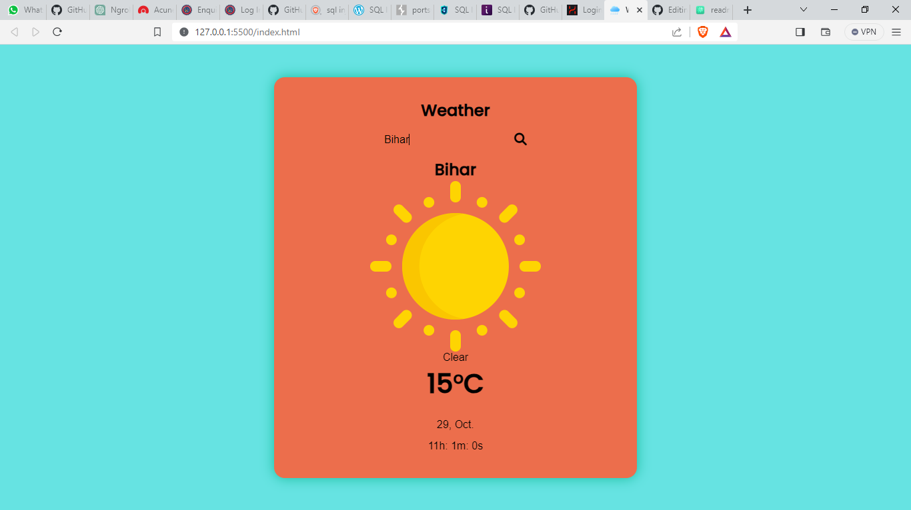

# Weather Website

A simple and user-friendly web-based weather application that provides real-time weather information for various locations around the world.



## Features

- **Current Weather:** Get up-to-date weather conditions for your selected location.
- **Five-Day Forecast:** Plan ahead with a five-day weather forecast.
- **Location Search:** Easily search for weather information in different cities.
- **Responsive Design:** Access the website from any device, including mobile and desktop.

## Demo

See the live demo: [Weather Website Demo](https:/github.com/raobadalyadav11)

## Getting Started

To run this project locally or set up your instance, follow these steps:

1. **Clone the repository:**

   ```bash
   git clone https://github.com/raobadalyadav/weather-website.git
   cd weather-website
## Authors

- [@raobadalyadav11](https://www.github.com/raobadalyadav)
